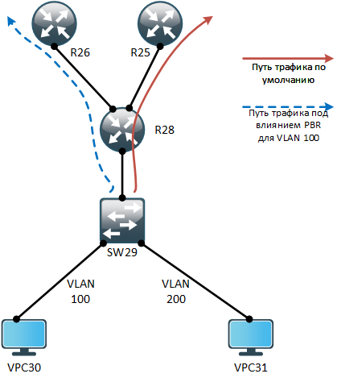

# Маршрутизация на основе политик (PBR)

## Цель:
Настроить политику маршрутизации в офисе Чокурдах. Распределить трафик между 2 линками.

## Задание:
  1. Настроить политику маршрутизации в офисе Чокурдах
  2. Распределить трафик между двумя линками с провайдером
  3. Настроить отслеживание линка через технологию IP SLA (только для IPv4)
  4. Настроить для офиса Лабытнанги маршрут по-умолчанию


### Настроить политику маршрутизации в офисе Чокурдах
Из офиса Чокурдах у нас идут 2 линка в сторону ISP Триада. Для того чтобы мы смогли пропинговать loopback-интерфейсы маршрутизаторов R25 и R26, нам необходимо везде прописать маршруты:

```
R25(config)#ip route 0.0.0.0 0.0.0.0 100.0.0.14
R25(config)#ip route 100.0.0.254 255.255.255.255 10.0.0.14
```

```
R26(config)#ip route 0.0.0.0 0.0.0.0 100.0.0.26
R26(config)#ip route 100.0.0.253 255.255.255.255 10.0.0.13
```

```
R28(config)#ip route 0.0.0.0 0.0.0.0 100.0.0.13 25 name "to R25 (ISP)"
R28(config)#ip route 0.0.0.0 0.0.0.0 100.0.0.25 50 name "to R26 (ISP)"
```


### Распределить трафик между двумя линками с провайдером
Предположим, что мы хотим трафик из VLAN 100 проходил через маршрутизатор R26. Для это воспользуемся конфигурационной командой ROUTE-MAP, где в качестве NEXT-HOP (укажем): 100.0.0.25.<br>
<center></center>

<br>Наш ROUTE-MAP будет выглядить следующим образом:

```
ip access-list extended PBR-TRAFFICVLAN100-ACL
 remark ===[ Traffic from VLAN 100 ]===
 permit ip 10.67.1.0 0.0.0.127 any

route-map PBR-TRAFFIC permit 10
 match ip address PBR-TRAFFICVLAN100-ACL
 set ip next-hop 100.0.0.25

interface Ethernet0/2.100
 ip policy route-map PBR-TRAFFIC
```


### Настроить отслеживание линка через технологию IP SLA (только для IPv4)
Предположим, мы хотим сделать следующее:
1. В случае если основной линк (R25) до ISP Триада упал, работал резервный линк (R26) до ISP Триада (и когда основной линк поднялся, маршрут обратно переписывался на него)
2. Сбалансировать нагрузку между обоими линками (с PBR в том числе)

Для этого нам необходимо будет переписать наш ROUTE-MAP и привязать его к тестам IP SLA. Внесем следующие изменения в маршрутизатор R28:

```
ip route 0.0.0.0 0.0.0.0 100.0.0.13 25 name "to R25 (ISP)" track 1
ip route 0.0.0.0 0.0.0.0 100.0.0.25 50 name "to R26 (ISP)" track 2

route-map PBR-TRAFFIC permit 10
 match ip address PBR-TRAFFICVLAN100-ACL
 set ip next-hop verify-availability 100.0.0.25 10 track 2
 set ip next-hop verify-availability 100.0.0.13 20 track 1

ip sla 1
 icmp-jitter 100.0.0.13 source-ip 100.0.0.14 num-packets 7
 frequency 7
ip sla schedule 1 life forever start-time now

ip sla 2
 icmp-jitter 100.0.0.25 source-ip 100.0.0.26 num-packets 7
 frequency 7
ip sla schedule 2 life forever start-time now

track 1 ip sla 1 reachability
track 2 ip sla 2 reachability
```


### Настроить для офиса Лабытнанги маршрут по-умолчанию

Задаем маршрут по-умолчанию на маршрутизаторе R27, следующей командой:
```
R27(config)#ip route 0.0.0.0 0.0.0.0 100.0.0.17
```

Полные файлы изменений приведены [здесь](config/)

