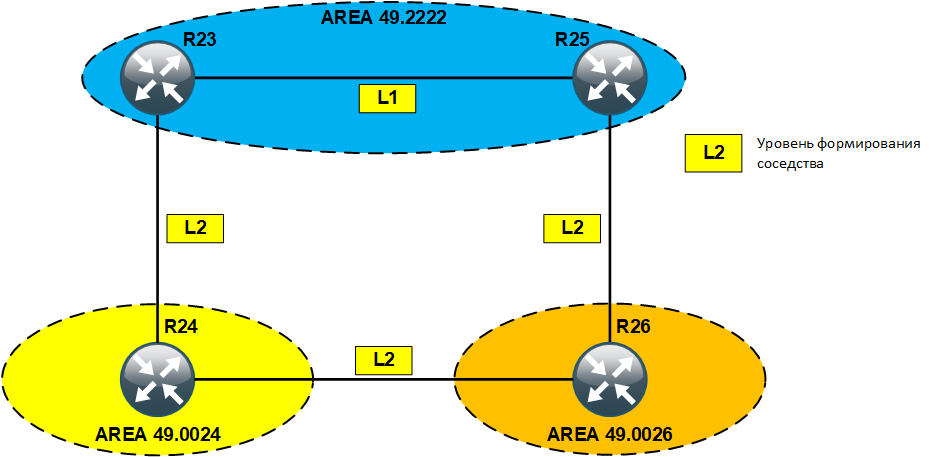

# IS-IS. Advanced

## Цель:
Настроить IS-IS офисе Триада

## Задание:
  1. Настроите IS-IS в ISP Триада
  2. R23 и R25 находятся в зоне 2222
  3. R24 находится в зоне 24
  4. R26 находится в зоне 26


### Настроите IS-IS в ISP Триада
Для того чтобы в офисе интернет провайдера Триада настроить IS-IS необходимо сначала запустить процесс IS-IS на соответствующих устройствах (маршрутизаторы: R23, R25, R24, R26), прописать области на которые разбита топология, указать правила формирования соседств и не забыть включить протокол IS-IS на соответствующем интерфейсе. Наша топология выглядит следующим образом:
<center></center><br>


### R23 и R25 находятся в зоне 2222
Запускаем процесс IS-IS на маршрутизаторах R23 и R25, прописываем область AREA 2222 (49.2222), указываем правило формирования соседства и включаем протокол IS-IS на необходимых нам интерфейсах. Все вышеперечисленное можно выполнить следующими командами (например, для маршрутизатора R23):

```
R23(config)#router isis TRIADA
R23(config-router)#net 49.2222.1000.0000.0251.00
R23(config-router)#is-type level-1-2
R23(config-router)#exit

R23(config)#interface Ethernet0/1
R23(config-if)#ip router isis TRIADA
R23(config-if)#isis circuit-type level-1
R23(config-if)#exit

R23(config)#interface Ethernet0/2
R23(config-if)#ip router isis TRIADA
R23(config-if)#isis circuit-type level-2-only
R23(config-if)#exit
```

Командой <b>show isis neighbors</b> посмотрим список установившихся IS-IS-соседей:
</code></pre>
</details>
<details>
<summary>show isis neighbors</summary>
<pre><code>
R23#sh isis neighbors

Tag TRIADA:
System Id      Type Interface   IP Address      State Holdtime Circuit Id
R25            L1   Et0/1       10.0.0.6        UP    8        R25.01
</code></pre>
</details>


### R24 находится в зоне 24
Запускаем процесс IS-IS на маршрутизаторе R24, прописываем область AREA 24 (49.0024), указываем правило формирования соседства и включаем протокол IS-IS на необходимых нам интерфейсах следующими командами:

```
R24(config)#router isis TRIADA
R24(config-router)#net 49.0024.1000.0000.0252.00
R24(config-router)#is-type level-2-only
R24(config-router)#exit

R24(config)#interface Ethernet0/1
R24(config-if)#ip router isis TRIADA
R24(config-if)#isis circuit-type level-2-only
R24(config-if)#exit

R24(config)#interface Ethernet0/2
R24(config-if)#ip router isis TRIADA
R24(config-if)#isis circuit-type level-2-only
R24(config-if)#exit
```


<br>

Полные файлы изменений приведены [здесь](config/)
