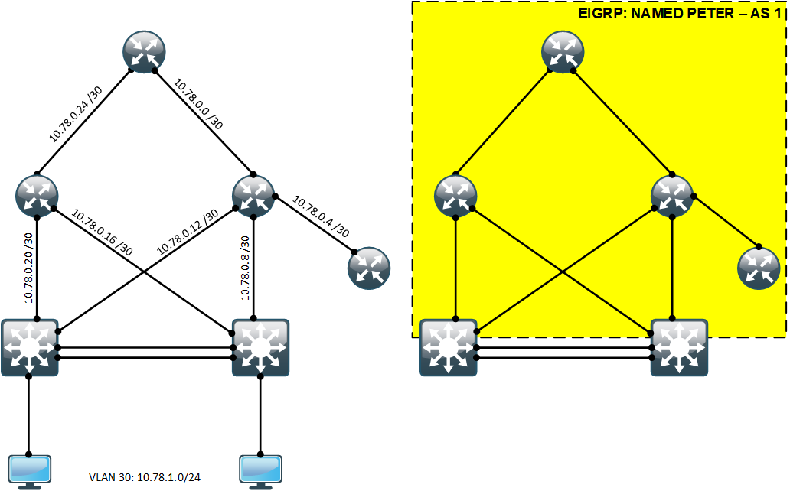

# EIGRP. Продолжение

## Цель:
Настроить EIGRP в офисе Санкт-Петербург. Использовать named EIGRP.

## Задание:
  1. В офисе Санкт-Петербург настроить EIGRP
  2. R32 получает только маршрут по умолчанию
  3. R16-17 анонсируют только суммарные префиксы


<br>

### Топология
<center></center>


### В офисе Санкт-Петербург настроить EIGRP
Для того чтобы в офисе Санкт-Петербург настроить EIGRP необходимо сначала запустить процесс EIGRP на соответствующих устройствах (маршрутизаторы: R18, R17, R16, R32; L3-коммутаторы SW9 и SW10), прописать подсети, loopback-интерфейсы и указать ROUTER-ID (пример для маршрутизатора R16):
```
router eigrp PETER
 !
 address-family ipv4 unicast autonomous-system 1
  !
  network 10.78.0.0 0.0.0.3
  network 10.78.0.4 0.0.0.3
  network 10.78.0.8 0.0.0.3
  network 10.78.0.12 0.0.0.3
  network 10.78.0.252 0.0.0.0
  eigrp router-id 10.78.0.252
 exit-address-family
```

Командой <b>show ip eigrp neighbors</b> список всех EIGRP-соседей:
</code></pre>
</details>
<details>
<summary>show ip eigrp neighbors</summary>
<pre><code>
R16#sh ip eigrp neighbors
EIGRP-IPv4 VR(PETER) Address-Family Neighbors for AS(1)
H   Address                 Interface              Hold Uptime   SRTT   RTO  Q  Seq
                                                   (sec)         (ms)       Cnt Num
3   10.78.0.1               Et0/1                     8 02:26:15    5   100  0  26
2   10.78.0.6               Et0/3                     9 02:26:17    5   100  0  9
1   10.78.0.14              Et0/2                     9 02:26:32    5   100  0  44
0   10.78.0.10              Et0/0                     8 02:26:32    4   100  0  36
</code></pre>
</details>


### R32 получает только маршрут по умолчанию
Командой <b>show ip route</b> посмотрим таблицу маршрутизации до фильтрации маршрутов:
</code></pre>
</details>
<details>
<summary>show ip route</summary>
<pre><code>
R32#sh ip route
Codes: L - local, C - connected, S - static, R - RIP, M - mobile, B - BGP
       D - EIGRP, EX - EIGRP external, O - OSPF, IA - OSPF inter area
       N1 - OSPF NSSA external type 1, N2 - OSPF NSSA external type 2
       E1 - OSPF external type 1, E2 - OSPF external type 2
       i - IS-IS, su - IS-IS summary, L1 - IS-IS level-1, L2 - IS-IS level-2
       ia - IS-IS inter area, * - candidate default, U - per-user static route
       o - ODR, P - periodic downloaded static route, H - NHRP, l - LISP
       a - application route
       + - replicated route, % - next hop override

Gateway of last resort is not set

      10.0.0.0/8 is variably subnetted, 15 subnets, 3 masks
D        10.78.0.0/30 [90/1536000] via 10.78.0.5, 00:02:24, Ethernet0/0
C        10.78.0.4/30 is directly connected, Ethernet0/0
L        10.78.0.6/32 is directly connected, Ethernet0/0
D        10.78.0.8/30 [90/1536000] via 10.78.0.5, 00:02:24, Ethernet0/0
D        10.78.0.12/30 [90/1536000] via 10.78.0.5, 00:02:24, Ethernet0/0
D        10.78.0.16/30 [90/2048000] via 10.78.0.5, 00:02:24, Ethernet0/0
D        10.78.0.20/30 [90/2048000] via 10.78.0.5, 00:02:24, Ethernet0/0
D        10.78.0.24/30 [90/2048000] via 10.78.0.5, 00:02:24, Ethernet0/0
D        10.78.0.249/32 [90/1536640] via 10.78.0.5, 00:02:24, Ethernet0/0
D        10.78.0.250/32 [90/1536640] via 10.78.0.5, 00:02:24, Ethernet0/0
C        10.78.0.251/32 is directly connected, Loopback0
D        10.78.0.252/32 [90/1024640] via 10.78.0.5, 00:02:24, Ethernet0/0
D        10.78.0.253/32 [90/2048640] via 10.78.0.5, 00:02:24, Ethernet0/0
D        10.78.0.254/32 [90/1536640] via 10.78.0.5, 00:02:24, Ethernet0/0
D        10.78.1.0/24 [90/1541120] via 10.78.0.5, 00:02:24, Ethernet0/0
</code></pre>
</details>

Задаем маршрут по-умолчанию на маршрутизаторе R18 и делаем редистрибьюцию статических маршрутов, следующими командами:
```
R18(config)#ip route 0.0.0.0 0.0.0.0 100.0.0.21 name "to R26 (ISP)"

R18(config)#router eigrp PETER
R18(config-router)#address-family ipv4 unicast autonomous-system 1
R18(config-router-af)#topology base
R18(config-router-af-topology)#redistribute static
```

Для того чтобы маршрутизатор R32 получал только маршрут по умолчанию, нам необходимо написать prefix-list и применить его на соответствующем интерфейсе маршрутизатора R32 на вход (запрещаем любые маршруты, кроме маршрута по умолчанию):
```
R32(config)#ip prefix-list R32-DefaultRoute seq 10 permit 0.0.0.0/0

R32(config)#router eigrp PETER
R32(config-router)# address-family ipv4 unicast autonomous-system 1
R32(config-router-af)#topology base
R32(config-router-af-topology)#distribute-list prefix R32-DefaultRoute in Ethernet0/0
R32(config-router-af-topology)#
```

Посмотрим что нам выведит команда <b>show ip prefix-list detail</b>:
</code></pre>
</details>
<details>
<summary>show ip prefix-list detail</summary>
<pre><code>
R32(config)#do show ip prefix-list detail
Prefix-list with the last deletion/insertion: R32-DefaultRoute
ip prefix-list R32-DefaultRoute:
   count: 1, range entries: 0, sequences: 10 - 10, refcount: 4
   seq 10 permit 0.0.0.0/0 (hit count: 1, refcount: 1)
</code></pre>
</details>

На маршрутизаторе создан один список префиксов с именем <b>«R32-DefaultRoute»</b> с одной записью. Мы видим запись вида: <b>seq 10 permit 0.0.0.0/0 (<i>hit count: 1</i>, refcount: 1)</b>. Значение <b><i>«hit count: 1»</i></b> означает что данное правило было применено 1 раз.

Проверяем таблицу маршрутов на маршрутизаторе R32:
</code></pre>
</details>
<details>
<summary>show ip route</summary>
<pre><code>
R32#sh ip route
Codes: L - local, C - connected, S - static, R - RIP, M - mobile, B - BGP
       D - EIGRP, EX - EIGRP external, O - OSPF, IA - OSPF inter area
       N1 - OSPF NSSA external type 1, N2 - OSPF NSSA external type 2
       E1 - OSPF external type 1, E2 - OSPF external type 2
       i - IS-IS, su - IS-IS summary, L1 - IS-IS level-1, L2 - IS-IS level-2
       ia - IS-IS inter area, * - candidate default, U - per-user static route
       o - ODR, P - periodic downloaded static route, H - NHRP, l - LISP
       a - application route
       + - replicated route, % - next hop override

Gateway of last resort is 10.78.0.5 to network 0.0.0.0

D*EX  0.0.0.0/0 [170/2048000] via 10.78.0.5, 00:01:10, Ethernet0/0
      10.0.0.0/8 is variably subnetted, 3 subnets, 2 masks
C        10.78.0.4/30 is directly connected, Ethernet0/0
L        10.78.0.6/32 is directly connected, Ethernet0/0
C        10.78.0.251/32 is directly connected, Loopback0
</code></pre>
</details>

Мы видим что в таблице маршрутизации отсутствует все подсети, кроме маршрута по умолчанию.


### R16-17 анонсируют только суммарные префиксы
Маршрутизатор R16 анонсирует следующие сети: 10.78.0.0/30, 10.78.0.4/30, 10.78.0.8/30 и 10.78.0.12/30. А маршрутизатор R17 анонсирует сети: 10.78.0.16/30, 10.78.0.20/30 и 10.78.0.24/30. Просуммируем анонсируемые сети вручную и пропишим суммарный маршрут на всех интерфейсах соответствующего маршрутизатора:

Суммарный маршрут для маршрутизатора R16 будет 10.78.0.0 255.255.255.240:
```
R16(config)#router eigrp PETER
R16(config-router)# address-family ipv4 unicast autonomous-system 1
R16(config-router-af)#af-interface e0/1
R16(config-router-af-interface)#summary-address 10.78.0.0 255.255.255.240
R16(config-router-af-interface)#exit
R16(config-router-af)#af-interface e0/2
R16(config-router-af-interface)#summary-address 10.78.0.0 255.255.255.240
R16(config-router-af-interface)#exit
R16(config-router-af)#af-interface e0/3
R16(config-router-af-interface)#summary-address 10.78.0.0 255.255.255.240
R16(config-router-af-interface)#exit
R16(config-router-af)#af-interface e0/0
R16(config-router-af-interface)#summary-address 10.78.0.0 255.255.255.240
R16(config-router-af-interface)#exit
R16(config-router-af)#exit
R16(config-router)#exit
```

Суммарный маршрут для маршрутизатора R17 будет 10.78.0.16 255.255.255.240:
```
R17(config)#router eigrp PETER
R17(config-router)# address-family ipv4 unicast autonomous-system 1
R17(config-router-af)#af-interface e0/1
R17(config-router-af-interface)#summary-address 10.78.0.16 255.255.255.240
R17(config-router-af-interface)#exit
R17(config-router-af)#af-interface e0/2
R17(config-router-af-interface)#summary-address 10.78.0.16 255.255.255.240
R17(config-router-af-interface)#exit
R17(config-router-af)#af-interface e0/0
R17(config-router-af-interface)#summary-address 10.78.0.16 255.255.255.240
R17(config-router-af-interface)#exit
R17(config-router-af)#exit
R17(config-router)#exit
```

Посмотрим таблицы маршрутизации на маршрутизаторах R16, R17 и R18:
</code></pre>
</details>
<details>
<summary>R16</summary>
<pre><code>
R16#sh ip route eigrp
Codes: L - local, C - connected, S - static, R - RIP, M - mobile, B - BGP
       D - EIGRP, EX - EIGRP external, O - OSPF, IA - OSPF inter area
       N1 - OSPF NSSA external type 1, N2 - OSPF NSSA external type 2
       E1 - OSPF external type 1, E2 - OSPF external type 2
       i - IS-IS, su - IS-IS summary, L1 - IS-IS level-1, L2 - IS-IS level-2
       ia - IS-IS inter area, * - candidate default, U - per-user static route
       o - ODR, P - periodic downloaded static route, H - NHRP, l - LISP
       a - application route
       + - replicated route, % - next hop override

Gateway of last resort is 10.78.0.1 to network 0.0.0.0

D*EX  0.0.0.0/0 [170/1536000] via 10.78.0.1, 01:06:07, Ethernet0/1
      10.0.0.0/8 is variably subnetted, 20 subnets, 4 masks
D        10.78.0.0/28 is a summary, 01:06:18, Null0
D        10.78.0.16/28 [90/2048000] via 10.78.0.14, 01:06:02, Ethernet0/2
                       [90/2048000] via 10.78.0.10, 01:06:02, Ethernet0/0
                       [90/2048000] via 10.78.0.1, 01:06:02, Ethernet0/1
D        10.78.0.16/30 [90/1536000] via 10.78.0.10, 01:06:11, Ethernet0/0
D        10.78.0.20/30 [90/1536000] via 10.78.0.14, 01:06:10, Ethernet0/2
D        10.78.0.24/30 [90/1536000] via 10.78.0.1, 01:06:07, Ethernet0/1
D        10.78.0.249/32 [90/1024640] via 10.78.0.10, 01:06:11, Ethernet0/0
D        10.78.0.250/32 [90/1024640] via 10.78.0.14, 01:06:10, Ethernet0/2
D        10.78.0.251/32 [90/1024640] via 10.78.0.6, 01:06:14, Ethernet0/3
D        10.78.0.253/32 [90/1536640] via 10.78.0.14, 01:06:02, Ethernet0/2
                        [90/1536640] via 10.78.0.10, 01:06:02, Ethernet0/0
                        [90/1536640] via 10.78.0.1, 01:06:02, Ethernet0/1
D        10.78.0.254/32 [90/1024640] via 10.78.0.1, 01:06:07, Ethernet0/1
D        10.78.1.0/24 [90/1029120] via 10.78.0.14, 01:06:10, Ethernet0/2
                      [90/1029120] via 10.78.0.10, 01:06:10, Ethernet0/0
</code></pre>
</details>

</code></pre>
</details>
<details>
<summary>R17</summary>
<pre><code>
R17#sh ip route eigrp
Codes: L - local, C - connected, S - static, R - RIP, M - mobile, B - BGP
       D - EIGRP, EX - EIGRP external, O - OSPF, IA - OSPF inter area
       N1 - OSPF NSSA external type 1, N2 - OSPF NSSA external type 2
       E1 - OSPF external type 1, E2 - OSPF external type 2
       i - IS-IS, su - IS-IS summary, L1 - IS-IS level-1, L2 - IS-IS level-2
       ia - IS-IS inter area, * - candidate default, U - per-user static route
       o - ODR, P - periodic downloaded static route, H - NHRP, l - LISP
       a - application route
       + - replicated route, % - next hop override

Gateway of last resort is 10.78.0.25 to network 0.0.0.0

D*EX  0.0.0.0/0 [170/1536000] via 10.78.0.25, 01:07:58, Ethernet0/1
      10.0.0.0/8 is variably subnetted, 18 subnets, 4 masks
D        10.78.0.0/28 [90/2048000] via 10.78.0.25, 01:07:55, Ethernet0/1
                      [90/2048000] via 10.78.0.22, 01:07:55, Ethernet0/0
                      [90/2048000] via 10.78.0.18, 01:07:55, Ethernet0/2
D        10.78.0.0/30 [90/1536000] via 10.78.0.25, 01:07:58, Ethernet0/1
D        10.78.0.8/30 [90/1536000] via 10.78.0.18, 01:08:02, Ethernet0/2
D        10.78.0.12/30 [90/1536000] via 10.78.0.22, 01:08:02, Ethernet0/0
D        10.78.0.16/28 is a summary, 01:08:10, Null0
D        10.78.0.249/32 [90/1024640] via 10.78.0.18, 01:08:02, Ethernet0/2
D        10.78.0.250/32 [90/1024640] via 10.78.0.22, 01:08:02, Ethernet0/0
D        10.78.0.251/32 [90/2048640] via 10.78.0.25, 01:07:55, Ethernet0/1
                        [90/2048640] via 10.78.0.22, 01:07:55, Ethernet0/0
                        [90/2048640] via 10.78.0.18, 01:07:55, Ethernet0/2
D        10.78.0.252/32 [90/1536640] via 10.78.0.25, 01:07:55, Ethernet0/1
                        [90/1536640] via 10.78.0.22, 01:07:55, Ethernet0/0
                        [90/1536640] via 10.78.0.18, 01:07:55, Ethernet0/2
D        10.78.0.254/32 [90/1024640] via 10.78.0.25, 01:07:58, Ethernet0/1
D        10.78.1.0/24 [90/1029120] via 10.78.0.22, 01:08:02, Ethernet0/0
                      [90/1029120] via 10.78.0.18, 01:08:02, Ethernet0/2
</code></pre>
</details>

</code></pre>
</details>
<details>
<summary>R18</summary>
<pre><code>
R18#sh ip route eigrp
Codes: L - local, C - connected, S - static, R - RIP, M - mobile, B - BGP
       D - EIGRP, EX - EIGRP external, O - OSPF, IA - OSPF inter area
       N1 - OSPF NSSA external type 1, N2 - OSPF NSSA external type 2
       E1 - OSPF external type 1, E2 - OSPF external type 2
       i - IS-IS, su - IS-IS summary, L1 - IS-IS level-1, L2 - IS-IS level-2
       ia - IS-IS inter area, * - candidate default, U - per-user static route
       o - ODR, P - periodic downloaded static route, H - NHRP, l - LISP
       a - application route
       + - replicated route, % - next hop override

Gateway of last resort is 100.0.0.21 to network 0.0.0.0

      10.0.0.0/8 is variably subnetted, 17 subnets, 4 masks
D        10.78.0.0/28 [90/1536000] via 10.78.0.2, 01:09:47, Ethernet0/0
D        10.78.0.8/30 [90/2048000] via 10.78.0.26, 01:09:50, Ethernet0/1
D        10.78.0.12/30 [90/2048000] via 10.78.0.26, 01:09:50, Ethernet0/1
D        10.78.0.16/28 [90/1536000] via 10.78.0.26, 01:09:44, Ethernet0/1
D        10.78.0.16/30 [90/2048000] via 10.78.0.2, 01:09:49, Ethernet0/0
D        10.78.0.20/30 [90/2048000] via 10.78.0.2, 01:09:49, Ethernet0/0
D        10.78.0.249/32 [90/1536640] via 10.78.0.26, 01:09:49, Ethernet0/1
                        [90/1536640] via 10.78.0.2, 01:09:49, Ethernet0/0
D        10.78.0.250/32 [90/1536640] via 10.78.0.26, 01:09:49, Ethernet0/1
                        [90/1536640] via 10.78.0.2, 01:09:49, Ethernet0/0
D        10.78.0.251/32 [90/1536640] via 10.78.0.2, 01:09:47, Ethernet0/0
D        10.78.0.252/32 [90/1024640] via 10.78.0.2, 01:09:47, Ethernet0/0
D        10.78.0.253/32 [90/1024640] via 10.78.0.26, 01:09:44, Ethernet0/1
D        10.78.1.0/24 [90/1541120] via 10.78.0.26, 01:09:49, Ethernet0/1
                      [90/1541120] via 10.78.0.2, 01:09:49, Ethernet0/0
</code></pre>
</details>

<br>

Полные файлы изменений приведены [здесь](config/)
