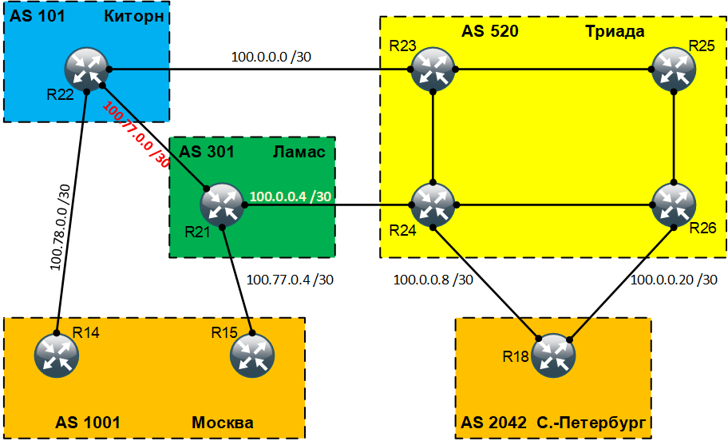

# BGP. Продолжение

## Цель:
Настроить BGP между автономными системами. Организовать доступность между офисами Москва и С.-Петербург

## Задание:
  1. Настроите eBGP между офисом Москва и двумя провайдерами - Киторн и Ламас
  2. Настроите eBGP между провайдерами Киторн и Ламас
  3. Настроите eBGP между Ламас и Триада
  4. Настроите eBGP между офисом С.-Петербург и провайдером Триада
  5. Организуете IP доступность между пограничным роутерами офисами Москва и С.-Петербург.


<br>

### Топология
<center></center>

<br>

### Настроите eBGP между офисом Москва и двумя провайдерами - Киторн и Ламас
Для того чтобы настроить eBGP между офисом Москва и двумя интернет провайдерами Киторн и Ламас необходимо сначала запустить процесс BGP на соответствующих устройствах (маршрутизаторы: R14, R15, R22, R21).

```
R14(config)#router bgp 1001
R14(config-router)#bgp log-neighbor-changes
R14(config-router)#neighbor 100.78.0.1 remote-as 101
R14(config-router)#exit

R15(config)#router bgp 1001
R15(config-router)#bgp log-neighbor-changes
R15(config-router)#neighbor 100.77.0.5 remote-as 301
R15(config-router)#exit

R22(config)#router bgp 101
R22(config-router)#bgp log-neighbor-changes
R22(config-router)#neighbor 100.0.0.1 remote-as 520
R22(config-router)#neighbor 100.77.0.1 remote-as 301
R22(config-router)#neighbor 100.78.0.2 remote-as 1001
R22(config-router)#exit

R21(config)#router bgp 301
R21(config-router)#bgp log-neighbor-changes
R21(config-router)#neighbor 100.0.0.5 remote-as 520
R21(config-router)#neighbor 100.77.0.2 remote-as 101
R21(config-router)#neighbor 100.77.0.6 remote-as 1001
R21(config-router)#exit
```

Командой <b>show ip bgp neighbors</b> посмотрим информацию о BGP-соседях:
</code></pre>
</details>
<details>
<summary>show ip bgp neighbors</summary>
<pre><code>
R14#sh ip bgp neighbors
BGP neighbor is 100.78.0.1,  remote AS 101, external link
  BGP version 4, remote router ID 100.78.0.254
  BGP state = Established, up for 01:25:18
  Last read 00:00:16, last write 00:00:31, hold time is 180, keepalive interval is 60 seconds
  Neighbor sessions:
    1 active, is not multisession capable (disabled)
  Neighbor capabilities:
    Route refresh: advertised and received(new)
    Four-octets ASN Capability: advertised and received
    Address family IPv4 Unicast: advertised and received
    Enhanced Refresh Capability: advertised and received
    Multisession Capability:
    Stateful switchover support enabled: NO for session 1
</code></pre>
</details>

Мы видим что у маршрутизатора R14 один сосед с IP-адресом 100.78.0.1 в автономной системе 101. Состояние BGP-соседства – <b>Established</b>.


### Настроите eBGP между провайдерами Киторн и Ламас


<br>

Полные файлы изменений приведены [здесь](config/)
