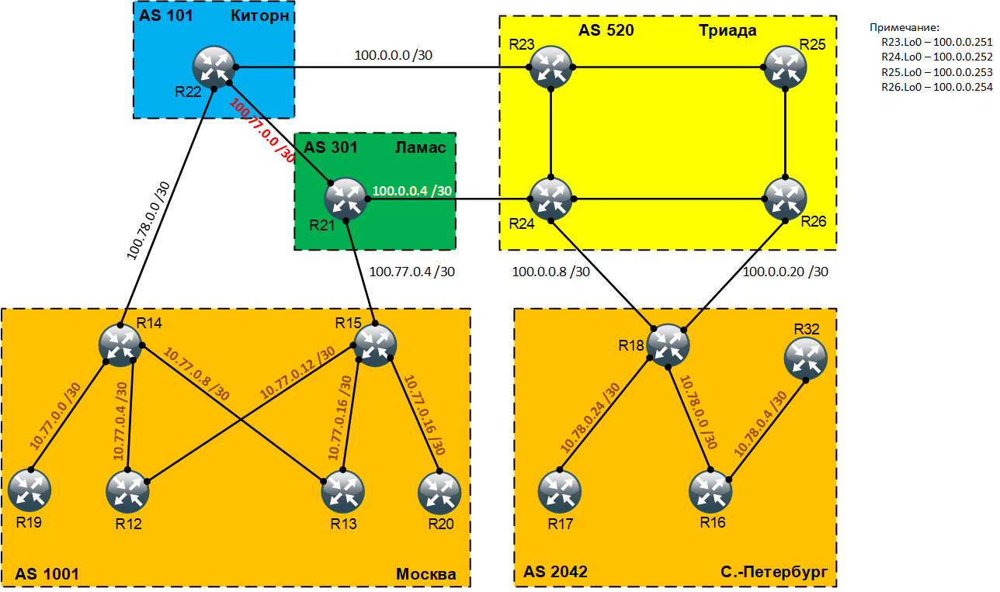

# Масштабируемость и дизайн iBGP

## Цель:
Настроить iBGP в офисе Москва
Настроить iBGP в сети провайдера Триада
Организовать полную IP связанность всех сетей

## Задание:
  1. Настроите iBGP в офисом Москва между маршрутизаторами R14 и R15.
  2. Настроите iBGP в провайдере Триада, с использованием RR.
  3. Настройте офиса Москва так, чтобы приоритетным провайдером стал Ламас.
  4. Настройте офиса С.-Петербург так, чтобы трафик до любого офиса распределялся по двум линкам одновременно.
  5. Все сети в лабораторной работе должны иметь IP связность.

### Топология
<center></center>

<br>

### Настроите iBGP в офисом Москва между маршрутизаторами R14 и R15
Прямого соединения между маршрутизаторами R14 и R15 у нас нет, но есть соединения через маршрутизаторы R12 и R13 на которых работает алгоритм маршрутизации OSPF и следовательно есть маршруты до Loopback-интерфейсов. iBGP соседство можно построить с помощью Loopback-интерфейсов, для этого сделаем следующие изменения на маршрутизаторах R14 и R15:
```
R14(config)#router bgp 1001
R14(config-router)#neighbor 10.77.0.253 remote-as 1001
R14(config-router)#neighbor 10.77.0.253 update-source Loopback0
R14(config-router)#exit

R15(config)#router bgp 1001
R15(config-router)#neighbor 10.77.0.254 remote-as 1001
R15(config-router)#neighbor 10.77.0.254 update-source Loopback0
R15(config-router)#exit


### Настройте офис Москва так, чтобы приоритетным провайдером стал Ламас


### Настройте офис Санкт-Петербург так, чтобы трафик до любого офиса распределялся по двум линкам одновременно
Для того чтобы трафик с офиса Санкт-Петербург распределялся по двум линкам одновременно воспользуемся следующей командой для настройки BGP:

```
R18(config)#router bgp 2042
R18(config-router)#bgp bestpath as-path multipath-relax
R18(config-router)#maximum-paths 2
R18(config-router)#exit

<br>

Полные файлы изменений приведены [здесь](config/)
