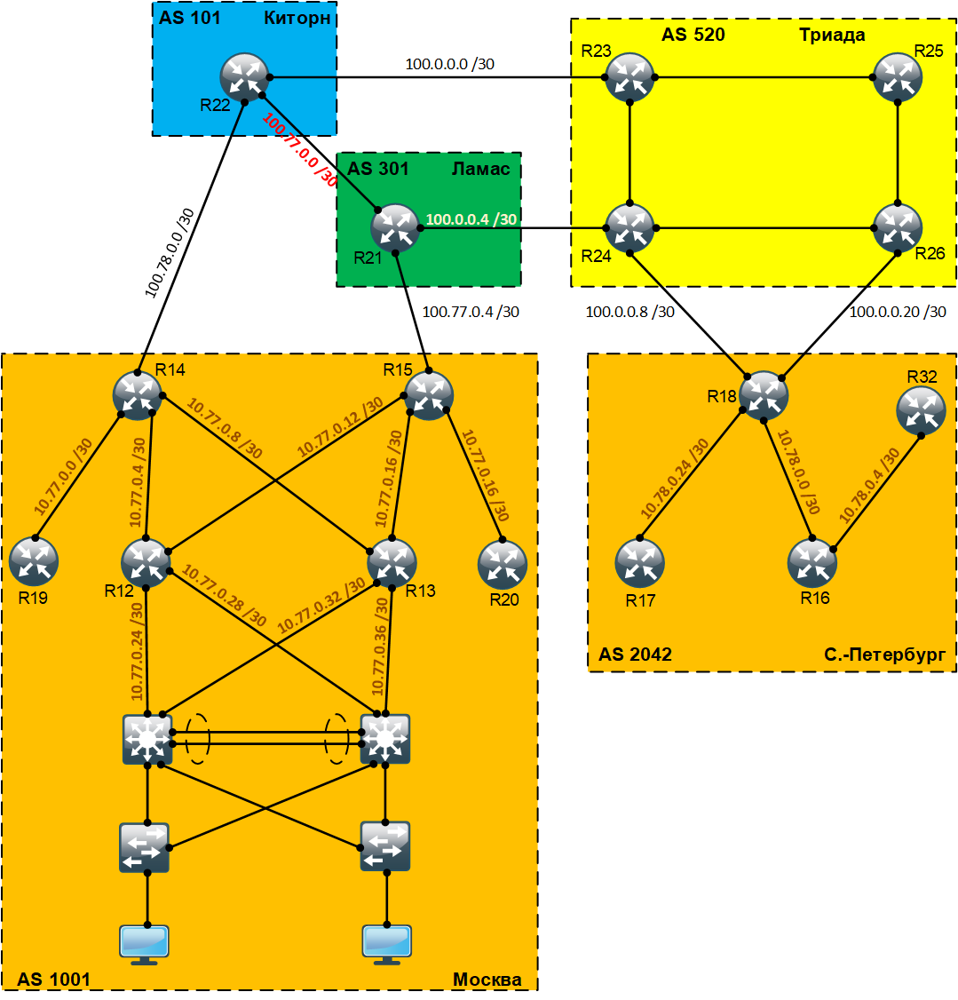

# Основные протоколы сети интернет

## Цель:
Настроить DHCP в офисе Москва <br>
Настроить синхронизацию времени в офисе Москва <br>
Настроить NAT в офисе Москва, C.-Перетбруг и Чокурдах <br>

## Задание:
  1. Настроите NAT(PAT) на R14 и R15. Трансляция должна осуществляться в адрес автономной системы AS1001.
  2. Настроите NAT(PAT) на R18. Трансляция должна осуществляться в пул из 5 адресов автономной системы AS2042.
  3. Настроите статический NAT для R20.
  4. Настроите NAT так, чтобы R19 был доступен с любого узла для удаленного управления.
  5. Настроите статический NAT(PAT) для офиса Чокурдах.
  6. Настроите для IPv4 DHCP сервер в офисе Москва на маршрутизаторах R12 и R13. VPC1 и VPC7 должны получать сетевые настройки по DHCP.
  7. Настроите NTP сервер на R12 и R13. Все устройства в офисе Москва должны синхронизировать время с R12 и R13.

### Топология
<center></center>

<br>

### Настроите NAT(PAT) на R14 и R15. Трансляция должна осуществляться в адрес автономной системы AS1001
Для того чтобы настроить NAT(PAT) на маршрутизаторах R14 и R15, воспользуемся следующими конфигурационными командами:

```
R15(config)#int e0/1
R15(config-if)#ip nat inside
R15(config-if)#exit

R15(config)#int e0/0
R15(config-if)#ip nat inside
R15(config-if)#exit

R15(config)#int e0/3
R15(config-if)#ip nat inside
R15(config-if)#exit

R15(config)#int e0/2
R15(config-if)#ip nat outside
R15(config-if)#exit

R15(config)#access-list 10 permit host 1.1.1.14
R15(config)#access-list 10 permit host 1.1.1.15
R15(config)#access-list 10 permit 10.77.1.0 0.0.0.127
R15(config)#access-list 10 permit 10.77.1.128 0.0.0.127

R15(config)#ip nat inside source list 10 interface Ethernet0/2 overload
```

Воспользуемся командами <b>ping</b> и <b>show ip nat translations</b> чтобы убедиться что у нас работает трансляция:

</code></pre>
</details>
<details>
<summary>ping</summary>
<pre><code>
R15#ping 100.77.0.5 source loopback1
Type escape sequence to abort.
Sending 5, 100-byte ICMP Echos to 100.77.0.5, timeout is 2 seconds:
Packet sent with a source address of 1.1.1.15
!!!!!
Success rate is 100 percent (5/5), round-trip min/avg/max = 1/1/1 ms
</code></pre>
</details>

</code></pre>
</details>
<details>
<summary>show ip nat translations</summary>
<pre><code>
R15#sh ip nat translations
Pro Inside global      Inside local       Outside local      Outside global
icmp 100.77.0.6:1      1.1.1.15:1         100.77.0.5:1       100.77.0.5:1
</code></pre>
</details>

### Настроите NAT(PAT) на R18. Трансляция должна осуществляться в пул из 5 адресов автономной системы AS2042
Для того чтобы настроить NAT(PAT) на маршрутизаторе R18 с возможностью трансляции в пул из 5 адресов нам необходимо воспользоваться следующими конфигурационными командами:

```
R18(config)#int e0/2
R18(config-if)#ip nat outside
R18(config-if)#exit

R18(config)#int e0/3
R18(config-if)#ip nat outside
R18(config-if)#exit

R18(config)#int e0/1
R18(config-if)#ip nat inside
R18(config-if)#exit

R18(config)#int e0/0
R18(config-if)#ip nat inside
R18(config-if)#exit

R18(config)#access-list 10 permit host 1.1.1.18
R18(config)#access-list 10 permit 10.78.0.0 0.0.0.255

R18(config)#ip nat pool R18-POOL 178.0.0.1 178.0.0.6 netmask 255.255.255.0
R18(config)#ip nat inside source list 10 pool R18-POOL
```

Воспользуемся командами <b>ping</b> и <b>show ip nat statistics</b> чтобы посмотреть информацию о количестве и типе активных переводов, параметрах конфигурации NAT, количестве адресов в пуле и количестве выделенных адресов:

</code></pre>
</details>
<details>
<summary>ping</summary>
<pre><code>
R18#ping 100.0.0.9
Type escape sequence to abort.
Sending 5, 100-byte ICMP Echos to 100.0.0.9, timeout is 2 seconds:
!!!!!
Success rate is 100 percent (5/5), round-trip min/avg/max = 1/1/1 ms
</code></pre>
</details>

</code></pre>
</details>
<details>
<summary>show ip nat statistics</summary>
<pre><code>
R18sh ip nat statistics
Total active translations: 2 (0 static, 2 dynamic; 1 extended)
Peak translations: 2, occurred 00:01:23 ago
Outside interfaces:
  Ethernet0/2, Ethernet0/3
Inside interfaces:
  Ethernet0/0, Ethernet0/1
Hits: 40  Misses: 0
CEF Translated packets: 5, CEF Punted packets: 0
Expired translations: 2
Dynamic mappings:
-- Inside Source
[Id: 3] access-list 10 pool R18-POOL refcount 2
 pool R18-POOL: netmask 255.255.255.0
        start 178.0.0.1 end 178.0.0.5
        type generic, total addresses 5, allocated 1 (20%), misses 0
Total doors: 0
Appl doors: 0
Normal doors: 0
Queued Packets: 0
</code></pre>
</details>


<br>

Полные файлы изменений приведены [здесь](config/)
