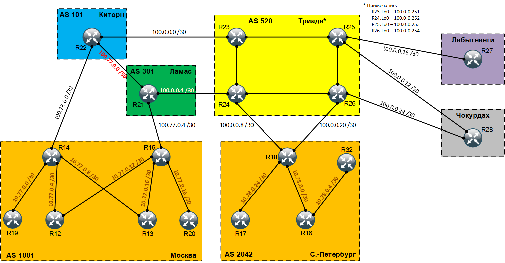

# DMVPN

## Цель:
Настроить GRE между офисами Москва и Санкт-Петербург <br>
Настроить DMVPN между офисами Москва и Чокурдах, Лабытнанги <br>

## Задание:
  1. Настроите GRE между офисами Москва и Санкт-Петербург
  2. Настроите DMVPN между Москва и Чокурдах, Лабытнанги

### Топология
<center></center>


### Настроите GRE между офисами Москва и Санкт-Петербург
Для организации GRE-туннеля между офисом в г. Москва и офисом в г. Санкт-Петербург воспользуемся следующими конфигурационными командами на маршрутизаторах R15 и R18.

```
R15(config)#interface Tunnel0
R15(config-if)#ip address 172.16.0.1 255.255.255.252
R15(config-if)#ip mtu 1400
R15(config-if)#ip tcp adjust-mss 1360
R15(config-if)#tunnel source Ethernet0/2
R15(config-if)#tunnel destination 100.0.0.10
R15(config-if)#tunnel path-mtu-discovery
R15(config-if)#exit
```

```
R18(config)#interface Tunnel0
R18(config-if)#ip address 172.16.0.2 255.255.255.252
R18(config-if)#ip mtu 1400
R18(config-if)#ip tcp adjust-mss 1360
R18(config-if)#tunnel source Ethernet0/2
R18(config-if)#tunnel destination 100.77.0.6
R18(config-if)#tunnel path-mtu-discovery
R18(config-if)#exit
```

Пропингуем туннельные-интерфейсы маршрутизаторов R15 и R18:

</code></pre>
</details>
<details>
<summary>R15</summary>
<pre><code>
R15#ping 172.16.0.2
Type escape sequence to abort.
Sending 5, 100-byte ICMP Echos to 172.16.0.2, timeout is 2 seconds:
!!!!!
Success rate is 100 percent (5/5), round-trip min/avg/max = 1/1/2 ms
</code></pre>
</details>

</code></pre>
</details>
<details>
<summary>R18</summary>
<pre><code>
R18#ping 172.16.0.1
Type escape sequence to abort.
Sending 5, 100-byte ICMP Echos to 172.16.0.1, timeout is 2 seconds:
!!!!!
Success rate is 100 percent (5/5), round-trip min/avg/max = 1/1/3 ms
</code></pre>
</details>

Мы видим что пинг между туннельными интерфейсами проходит в обе стороны.

<br>

### Настроите DMVPN между Москва и Чокурдах, Лабытнанги
Для организации DMVPN между офисом в г. Москва и офисам в Чокурдах, Лабытнанги воспользуемся следующими конфигурационными командами на маршрутизаторах R15, R27 и R28. Причем маршрутизатор R15 будет выступать в качестве HUB(а), а маршрутизаторы R27 и R28 в качестве SPOK(-ов). Так как на маршрутизаторе R15 работает OSPF, то и на марштуризаторах R27 и R28 необходимо запустить тоже OSPF и не забыть прописать необходимые сети.

```
R15(config)#interface Tunnel100
R15(config-if)#ip address 172.16.1.254 255.255.255.0
R15(config-if)#no ip redirects
R15(config-if)#ip mtu 1400
R15(config-if)#ip nhrp map multicast dynamic
R15(config-if)#ip nhrp network-id 100
R15(config-if)#ip nhrp registration no-unique
R15(config-if)#ip tcp adjust-mss 1360
R15(config-if)#ip ospf network broadcast
R15(config-if)#ip ospf priority 255
R15(config-if)#keepalive 15 3
R15(config-if)#tunnel source Ethernet0/2
R15(config-if)#tunnel mode gre multipoint
R15(config-if)#tunnel path-mtu-discovery
R15(config-if)#exit
```

```
R28(config)#interface Tunnel100
R28(config-if)#ip address 172.16.1.1 255.255.255.0
R28(config-if)#no ip redirects
R28(config-if)#ip mtu 1400
R28(config-if)#ip nhrp map 172.16.1.254 100.77.0.6
R28(config-if)#ip nhrp map multicast 100.77.0.6
R28(config-if)#ip nhrp network-id 100
R28(config-if)#ip nhrp nhs 172.16.1.254
R28(config-if)#ip nhrp registration no-unique
R28(config-if)#ip tcp adjust-mss 1360
R28(config-if)#ip ospf network broadcast
R28(config-if)#ip ospf priority 0
R28(config-if)#keepalive 15 3
R28(config-if)#tunnel source Ethernet0/0
R28(config-if)#tunnel mode gre multipoint
R28(config-if)#tunnel path-mtu-discovery
R28(config-if)#exit
```

```
R27(config)#interface Tunnel100
R27(config-if)#ip address 172.16.1.2 255.255.255.0
R27(config-if)#no ip redirects
R27(config-if)#ip mtu 1400
R27(config-if)#ip nhrp map 172.16.1.254 100.77.0.6
R27(config-if)#ip nhrp map multicast 100.77.0.6
R27(config-if)#ip nhrp network-id 100
R27(config-if)#ip nhrp nhs 172.16.1.254
R27(config-if)#ip nhrp registration no-unique
R27(config-if)#ip tcp adjust-mss 1360
R27(config-if)#ip ospf network broadcast
R27(config-if)#ip ospf priority 0
R27(config-if)#keepalive 15 3
R27(config-if)#tunnel source Ethernet0/0
R27(config-if)#tunnel mode gre multipoint
R27(config-if)#tunnel path-mtu-discovery
R27(config-if)#exit
```

С помощью команды <b>show dmvpn</b> проверим статус DMVPN и NHRP:

</code></pre>
</details>
<details>
<summary>show dmvpn</summary>
<pre><code>
R15#show dmvpn
Legend: Attrb --> S - Static, D - Dynamic, I - Incomplete
        N - NATed, L - Local, X - No Socket
        # Ent --> Number of NHRP entries with same NBMA peer
        NHS Status: E --> Expecting Replies, R --> Responding, W --> Waiting
        UpDn Time --> Up or Down Time for a Tunnel
==========================================================================

Interface: Tunnel100, IPv4 NHRP Details
Type:Hub, NHRP Peers:2,

   Ent  Peer NBMA Addr Peer Tunnel Add State  UpDn Tm Attrb
 ===== =====================================================
&#32;&#32;&#32;&#32;&#32;1 100.0.0.26           172.16.1.1    UP 01:23:17     D
&#32;&#32;&#32;&#32;&#32;1 100.0.0.18           172.16.1.2    UP 01:42:21     D
</code></pre>
</details>

<br>

Полные файлы изменений приведены [здесь](config/)


