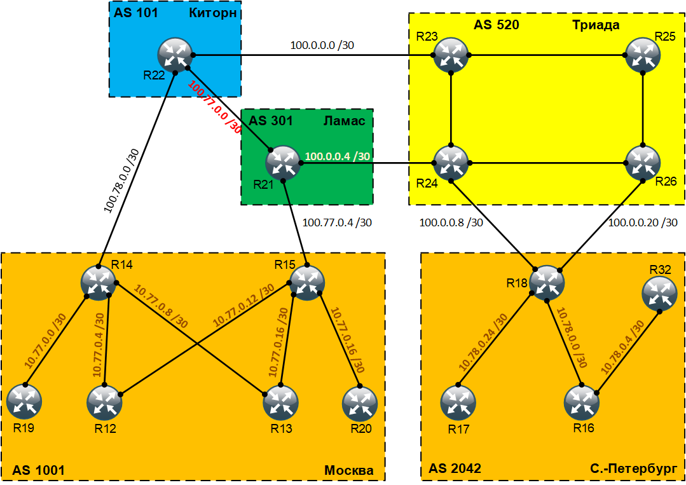

# MPLS. Основные концепции и сервисы

## Цель:
Настроить BGP free core в офисах Москвы и Санкт-Петербурга <br>

## Задание:
  1. Настроите BGP free core в офисе Москвы
  2. Настроите BGP free core в офисе Санкт-Петербурга

### Топология
<center></center>


### Настроите BGP free core в офисе Москвы
Чтобы запустить BGP free Core в офисе Москва нам необходимо включить MPLS и LDP на соответствующих интерфейсах в сторону нашей сети на всех устройствах в автономной системе. Соответственно, на маршрутизаторах R14 и R15 активируем MPLS на интерфейсах e0/0, e0/1, e0/3. А на маршрутизаторах R12 и R13 активируем MPLS на интерфейсах e0/2, e0/3. 

```
Rxx(config)#mpls ip
Rxx(config)#int range e0/0-1, e0/3
Rxx(config-if-range)#mpls ip
Rxx(config-if-range)#mpls label protocol ldp
Rxx(config-if-range)#exit
```


### Настроите BGP free core в офисе Санкт-Петербурга


<br>

Полные файлы изменений приведены [здесь](config/)
