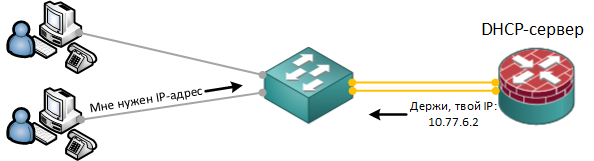

### DHCP (Dynamic Host Configuration Protocol)

DHCP — это сетевой протокол прикладного уровня в сетях TCP/IP, который позволяет автоматически назначать IP-адреса и другие параметры конфигурации сетевым устройствам.
<br><br>

<br><br>
Процесс получения сетевых параметров очень прост, он состоит из четырех этапов, которые можно описать "алгоритмом DORA":
- Discovery (обнаружение). При подключении к сети устройство отправляет широковещательное сообщение DHCPDISCOVER, чтобы найти DHCP-сервер;
- Offer (предложение). DHCP-сервер получает запрос и отвечает пакетом DHCPOFFER, предлагая свободный IP-адрес из своего пула адресов и другие сетевые параметры;
- Request (запрос). Клиент получает предложение и отправляет серверу сообщение DHCPREQUEST, подтверждая готовность принять предложенные параметры;
- Acknowledgement (подтверждение). Сервер закрепляет за устройством адрес и отправляет окончательные параметры.
После этого устройство может полноценно работать в сети. По окончании срока использования адреса или при перезагрузке устройства процедура повторяется.

Настроить DHCP протокол на оборудовании Cisco можно следующими конфигурационными командами:

1. На всякий пожарный мы включим необходимый нам сервис, затем укажем диапазон исключаемых из выдачи IP-адресов, укажем местоположение базы данных DHCP, настроим возможность обновлять обе (прямую и обратную) записи A и RTP на нашем сервере DNS и отключим использование протокола начальной самозагрузки BOOTP:
```
service dhcp
ip dhcp database flash:/dhcp-binding.dat timeout 60
ip dhcp update dns both override
no ip bootp server
no ip dhcp use vrf connected

ip dhcp excluded-address 10.77.6.1
ip dhcp ping packets 7
ip dhcp ping timeout 300
```

2. 


3. отключим использование VRF на интерфейсе, принимающем запросы на выдачу ip адреса;
4. обозначим местоположение базы данных DHCP. в принципе ее можно хранить и на flash CISCO;
5. данная настройка позволит обновлять обе (прямую и обратную) записи A и RTP на нашем сервере DNS;
6. отключим использование BOOTP (Bootstrap Protocol — протокол начальной самозагрузки) сервиса;
7. выполним сохранение наших настроек.


. на всякий случай данной командой мы включим необходимый нам сервис;
2. обозначим пул для нашей основной сети организации;
3. команда предназначено для импорта всех настроек в базу данных сервера DHCP;
4. обозначим нашу сеть;
5. укажем доменное имя нашей компании;
6. данной командой пропишем существующие DNS сервера в нашей сети;
7. данной командой пропишем существующие WINS сервера в нашей сети;
8. обозначим шлюз по умолчанию в нашей сети (это наша CISCO);
9. следующие три строчки отдадут клиентским компьютерам необходимые нам опции:
— option 4 – укажет ip адрес Time Server в нашей сети;
— option 42 – укажет ip адрес NTP Servers в нашей сети;
— option 150 – укажет нашим CISCO телефонам расположение TFTP сервера в сети для их конфигурации;
(более подробно о возможных опциях можно почитать тут).
10. командой lease укажем срок действия выданного ip адреса;
11. и наконец – включим обновление ARP таблицы в соответствии с выданным ip адресом;
12. выйдем из настройки нашего пула для основной сети…


1. укажем диапазон исключаемых из выдачи ip адресов (куда обязательно должен входить ip адрес нашего шлюза). я использую данный диапазон для серверов и различных сетевых устройств;
2. списков исключения может быть несколько (данный я использую для хостов, имеющих полный доступ в интернет – 192.168.103.80/28);
3. отключим использование VRF на интерфейсе, принимающем запросы на выдачу ip адреса;
4. обозначим местоположение базы данных DHCP. в принципе ее можно хранить и на flash CISCO;
5. данная настройка позволит обновлять обе (прямую и обратную) записи A и RTP на нашем сервере DNS;
6. отключим использование BOOTP (Bootstrap Protocol — протокол начальной самозагрузки) сервиса;
7. выполним сохранение наших настроек.


1. Для начала мы должны определиться что именно мы будем транслировать. Для этого мы создаем список доступа, в котором описываем какой трафик мы собираемся транслировать, а какой запретить к трансляции:
```
ip access-list extended NAT-InternetAccess-ACL
 remark ===[ We allow access to the Internet to users from the subnet: 10.77.6.0, 10.77.7.0 ]===
 permit ip 10.77.6.0 0.0.0.255 any
 permit ip 10.77.7.0 0.0.0.255 any
 remark ===[ We prohibit everything that is not parted, above ]===
 deny   ip any any
```

2. Затем помечаем интерфейсы которые будут участвовать в трансляции адресов. Внутренний интерфейс помечают командой ip nat inside, внешний — ip nat outside. Без этой разметки трансляция не сработает:
```
interface GigabitEthernet0/0/1
 description ===[ ISP: Dom.ru, Telephone: 8-495-981-45-71, Contract: 100771XXXXXX032 ]===
 ip nat outside

interface GigabitEthernet0/0/0
 no ip address
 negotiation auto
 channel-group 1 mode active

interface GigabitEthernet0/0/2
 no ip address
 negotiation auto
 channel-group 1 mode active

interface Port-channel1
 description ===[ Trunk channel for the RT-EDGE-MSK02 <---> SW-ACCESS-MSK02 ]===
 no ip address
 no negotiation auto

interface Port-channel1.100
 description ===[ VLAN: Server equipment of a company store ]===
 encapsulation dot1Q 100
 ip address 10.77.6.1 255.255.255.224
 ip nat inside
```

3. Финальным аккордом мы запускаем трансляцию следующей конфигурационной командой:
```
ip nat inside source list NAT-InternetAccess-ACL interface GigabitEthernet0/0/1 overload
```
