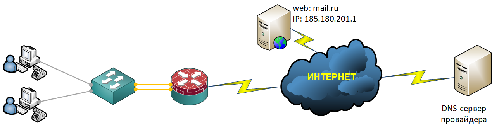

### DNS (Domain Name System)

Как известно в Cisco-маршрутизаторах заложена возможность работать как DNS-сервер - то есть переводить понятные человеку имена (например, mail.ru) в числовые IP-адреса, нужные для маршрутизации.

Чуть ниже я немного расскажу о концепции организации DNS-сервера и на примере конфигурационных команд проиллюстрирую как маршрутизатор Cisco превратить в DNS-сервер.
<br><br>

<br><br>
Концепция организации DNS-сервера в небольшом офисе достаточно проста, ввиду отсутствия в малом офисе серверов Linux или Windows c поднятым DNS-сервером этот функционал мы поручим исполнять маршрутизатору. Когда клиент в такой сети (рабочая станция, другое IP-оборудование) захочет узнать IP-адрес по имени, он отправит соответствующий запрос на маршрутизатор. Увидев такой запрос маршрутизатор будет его обрабатывать следующим образом: если запрошенное имя есть в локальной таблице маршрутизатора, то клиент практически сразу получит его IP-адрес. Если запрошенного имени в таблице нет, маршрутизатор перешлет запрос дальше - на другой DNS-сервер (например, на DNS-сервер провайдера), чтобы тот нашел ответ. Такой принцип организации DNS-сервера используется в удаленных филиалах предприятия, в центральном же офисе предприятия все иначе.

Конфигурирование DNS-сервера на сетевом оборудовании Cisco производиться следующим образом:

```
ip dns server
ip domain-lookup
ip name-server 176.213.132.3 5.3.3.3
```

Такой способ конфигурации маршрутизатора Cisco в качестве DNS-сервера, приводит к тому что маршрутизатор будет отвечать на все DNS-запросы: как изнутри так и снаружи. Что может привести к тому что маршрутизатор может быть использован в качестве DDoS-амплификатора. Для того чтобы этого избежать необходимо запретить доступ к нашему DNS-серверу из вне:

```
ip dns view-list DNS-DnsAccessRule-VLT
 view default 1
  restrict source access-group DNS-DnsAccessRule-ACL
ip dns server view-group DNS-DnsAccessRule-VLT
```

```
ip access-list extended DNS-DnsAccessRule-ACL
 remark ===[ We allow access to the DNS server to users from the subnet: 10.77.6.0, 10.77.7.0 ]===
 permit ip 10.77.6.0 0.0.0.255 any
 permit ip 10.77.7.0 0.0.0.255 any
 remark ===[ We prohibit everything that is not parted, above ]===
 deny   ip any any
```
