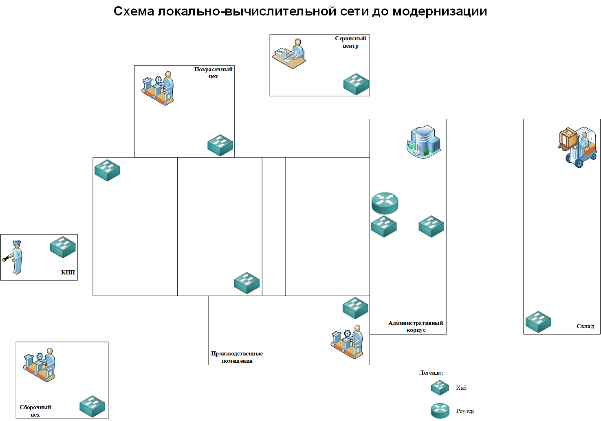

### Как мы модернизировали нашу сеть

Модернизация ЛВС предприятия — сложный и ответственный процесс: ошибка на любом этапе может обернуться простоем и финансовыми потерями.

Далее я поделюсь нашей историей — как команда из пяти специалистов несколько лет модернизировала сеть крупного производственного предприятия в Смоленской области.

## Аудит
Первое что необходимо было сделать команде это провести аудит текущей ИТ-инфраструктуры и понять какие компоненты нуждаются в модернизации. Для этого мы начали собирать информацию об используемом сетевом и сервером оборудовании, составе и принципах функционирования системы видеонаблюдения и телефонии. Дополнительно мы собрали сведения о применяемых программных средствах и фактических сценариях его использования.

Работая над сбором необходимой нам информации мы столкнулись с первыми трудностями как же без них. Документация, описывающая текущую сетевую инфраструктуру, была либо неполной или устаревшей, либо отсутствовала совсем. В связи с открывшимися обстоятельствами мы приняли решение, разработать собственную схему текущей сетевой инфраструктуры (так как мы ее видим и понимаем).

Наше решение не было идеальным, мы постоянно сталкивались загадками функционирования той или иной "сетевой сущности" в каком либо здании. Например, в здании "торгово выставочного центра" функционировало 6 единиц сетевого оборудования, причем два из них попутно выполняли функции "точек доступа" и покрывали определенную зону склада Wi-Fi сетью. Но как была организована Wi-Fi сеть в торговом зале для команды долго оставалось загадкой, об этом потом.

Работая над схемой текущей сетевой инфраструктуры мы попутно решали еще одну не мало важную задачу - это обследование состояния кабельной инфраструктуры. Наши усилия не были напрасными так как, такой подход позволил не только уточнить состав и структуру сетевых компонентов, но и получить информацию о местах размещения оборудования, условиях эксплуатации, а также выявить потенциальные проблемные участки кабельной сети. 

Таким образом, проведённые мероприятия обеспечили формирование целостного представления о текущем состоянии ИТ-инфраструктуры и создали основу для дальнейшего планирования модернизации.
 

 
 
 
 
 
 

(в дальнейшем собранная сопутствующая информация использовалась при проектировании сетевой инфраструктуры).

отсутствовала практически, либо не соответствовала хоть какому-то    

се  , хоть в каком либо приближении   и4♦ описывающая текущую   

стол столькнули с 

,    

Собрать информацию обо всем используемом   о    не только 

 
 
 
 
 
 
 
 

В качестве вводных, имеется довольно крупная сеть на базе решения Cisco, эксплуатируемая уже более 10 лет и состоящая из:

    1 348 зданий и сооружений;

    10 030 разнотипных точек доступа производства, начиная с откровенного старья AIR-LAP1131G, AIR-LAP1041N (около 88% от общего числа), заканчивая вполне себе неплохими CAP1602I, CAP2602I, CAP1702I, AP1832I;

    WISM1, WISM2, WLC 8540.

За более чем 10 лет эксплуатации кабельные линии стали приходить в негодность в результате различных перепланировок и капремонтов. Большое количество точек доступа и инжекторов питания стало выходить из строя, что вкупе с тенденцией роста потребления трафика привело к постоянным жалобам на качество сервиса.

С учетом сроков и возможностей бюджета решено, что на первом этапе модернизации будут подвергнуты сети в 589 зданиях, решение о дальнейшей модернизации будет принято после анализа последствий текущей модернизации. 

Сформулированы следующие задачи:

    замена вышедших из строя и устаревших точек доступа новыми и современными;

    обеспечение покрытия дополнительных зданий и помещений;

    замена коммутаторов доступа и инжекторов питания на PoE коммутаторы;

    реконструкция существующих кабельных линий связи и формирование новых от активного оборудования до точек доступа.

  

  

 
 
 
 
 
 
 
 

На начальном этапе работы команде необходимо было провести аудит текущей ИТ-инфраструктуры организации и определить, какие компоненты требуют модернизации. Для этого было выполнено обследование и сбор данных об используемом сетевом и серверном оборудовании, составе и принципах функционирования системы видеонаблюдения и телефонии, а также проведена оценка состояния кабельной инфраструктуры. Дополнительно были собраны сведения о применяемых программных средствах и фактических сценариях их использования.

В процессе сбора информации возникли первые трудности: документация, описывающая текущую сетевую инфраструктуру, либо была неполной и частично устаревшей, либо отсутствовала. В результате было принято решение разработать собственную схему текущей сетевой инфраструктуры, отражающую реальное состояние системы на момент обследования.

Разработка схемы осуществлялась параллельно с обследованием кабельной инфраструктуры. Такой подход позволил не только уточнить состав и структуру сетевых компонентов, но и получить информацию о местах размещения оборудования, условиях эксплуатации, а также выявить потенциальные проблемные участки кабельной сети.

Таким образом, проведённые мероприятия обеспечили формирование целостного представления о текущем состоянии ИТ-инфраструктуры и создали основу для дальнейшего планирования модернизации.
