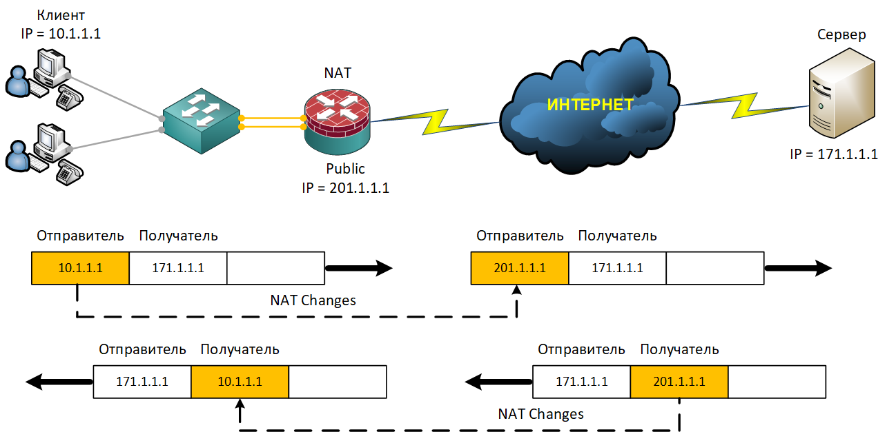

### NAT (Network Address Translation)

NAT — это механизм в сетях TCP/IP, который позволяет преобразовывать IP-адреса транзитных пакетов при их прохождении через маршрутизирующее устройство. Он обеспечивает взаимодействие локальной сети с интернетом, скрывая внутренние IP-адреса устройств от внешней сети и экономя ограниченные публичные IP-адреса.
<br><br>

<br><br>
Принцип работы NAT очень прост: когда устройство из частной сети отправляет пакет во внешнюю сеть, маршрутизатор перехватывает этот пакет и подменяет его исходный IP-адрес на свой внешний (видимый из интернета). Если используется PAT (Port Address Translation), дополнительно происходит преобразование номеров портов, чтобы различать пакеты от разных устройств за одним адресом. После этого пакет отправляется в интернет с изменённым адресом. Когда ответный пакет приходит обратно из внешней сети, маршрутизатор ищет соответствие во внутренней таблице NAT: на какой внутренний IP-адрес и порт нужно переслать этот ответ. Затем внешний IP-адрес в пакете снова заменяется на приватный, и данные доставляются нужному устройству внутри локальной сети.

Настроить NAT на оборудовании Cisco очень просто:

1. Для начала мы должны определиться что именно мы будем транслировать. Для этого мы создаем список доступа, в котором описываем какой трафик мы собираемся транслировать, а какой запретить к трансляции:
```
ip access-list extended NAT-InternetAccess-ACL
 remark ===[ We allow access to the Internet to users from the subnet: 10.77.6.0, 10.77.7.0 ]===
 permit ip 10.77.6.0 0.0.0.255 any
 permit ip 10.77.7.0 0.0.0.255 any
 remark ===[ We prohibit everything that is not parted, above ]===
 deny   ip any any
```

2. Затем помечаем интерфейсы которые будут участвовать в трансляции адресов. Внутренний интерфейс помечают командой ip nat inside, внешний — ip nat outside. Без этой разметки трансляция не сработает:
```

```


3. 


ip nat inside source list NAT-InternetAccess-ACL interface GigabitEthernet0/0/1 overload


Осталось настроить NAT на интерфейсах, которые являются либо внутренними (inside), либо внешними (outside) с точки зрения NAT.


Пометьте интерфейсы. Внутренний интерфейс помечают командой ip nat inside, внешний — ip nat outside. Без этой разметки трансляция не сработает.


3.    определяем  разрешаем нужный трафик 


Определите, что именно транслировать. Для этого создают списки доступа (ACL — access-list), которые разрешают нужный трафик (например, все адреса из внутренней подсети).


Конфигурирование NTP протокола на сетевом оборудовании Cisco производиться следующим образом:

    Затем нам необходимо определиться со списком NTP-серверов в сети Интернет, с которых мы будем забирать время. Тем самым мы ограничим круг внешних NTP-серверов для синхронизации времени и немного повысим свою безопасность:

ip access-list extended NTP-NtpServerSourcePeers-ACL
 remark ===[ Allow access to external NTP server - ntp.msk-ix.ru ]===
 permit udp host 194.190.168.1 any
 remark ===[ Allow access to external NTP server - ntp0.ntp-servers.net ]===
 permit udp host 88.147.254.227 any
 remark ===[ Allow access to external NTP server - ntp3.ntp-servers.net ]===
 permit udp host 88.147.254.229 any
 remark ===[ Allow access to external NTP server - ntp6.ntp-servers.net ]===
 permit udp host 88.147.254.235 any
 remark ===[ We prohibit everything that is not parted, above ]===
 deny   ip any any

    На следующем шаге мы определяем список IP-адресов устройств или подсетей, которым мы разрешим синхронизировать свое время с нашим NTP-сервером. Делаем это мы с помощью списков доступа, и еще немного повышаем свою безопасность:

ip access-list extended NTP-NtpClientsDestinationPeers-ACL
 remark ===[ Allow access to the internal NTP server from the subnet: 10.77.5.0 - 10.77.5.255 ]===
 permit udp 10.77.5.0 0.0.0.255 host 10.77.5.1 eq ntp
 remark ===[ Allow access to the internal NTP server from the subnet: 10.77.6.0 - 10.77.6.255 ]===
 permit udp 10.77.6.0 0.0.0.255 host 10.77.5.1 eq ntp
 remark ===[ Allow access to the internal NTP server from the subnet: 10.77.7.0 - 10.77.7.255 ]===
 permit udp 10.77.7.0 0.0.0.255 host 10.77.5.1 eq ntp
 remark ===[ We prohibit everything that is not parted, above ]===
 deny   ip any any

    Практически на финальном этапе по конфигурированию NTP протокола на оборудовании Cisco мы должны сделать следующее: включить логирование событий с нашего NTP-сервера; задать интерфейс с которого мы будем раздавать время; задать список откуда мы будем забирать время и кому будем его отдавать; не забываем включить NTP-сервер и указать основной NTP-сервер в глобальной сети Интернет, с которым мы будем синхронизировать время:

ntp logging
ntp source Port-channel1.998
ntp access-group peer NTP-NtpServerSourcePeers-ACL kod
ntp access-group serve NTP-NtpClientsDestinationPeers-ACL kod
ntp master 3
ntp server 194.190.168.1 prefer source GigabitEthernet0/0/1
ntp server 88.147.254.235 source GigabitEthernet0/0/1
ntp server 88.147.254.227 source GigabitEthernet0/0/1
ntp server 88.147.254.229 source GigabitEthernet0/0/1

    Финальным аккордом по конфигурированию NTP протокола на оборудовании Cisco, мы должны включить работу NTP протокола на интерфейсе который смотрит в глобальную сеть Интернет:

interface GigabitEthernet0/0/1
 description ===[ ISP: Dom.ru, Telephone: 8-495-981-45-71, Contract: 100771XXXXXX032 ]===
 no ntp disable

Для того чтобы устройство Cisco смогло синхронизировать свое время с внутренним NTP-сервером мы можем использовать следующий конфигурационный код (например, для коммутатора):

ntp logging
ntp update-calendar
ntp server 10.77.5.1 prefer source Vlan998


можно в двух режимах: сервер (устройство раздает время) или клиент (устройство синхронизируется с внешним NTP-сервером).

Чуть ниже я немного расскажу о концепции организации NTP-сервера и на примере конфигурационных команд проиллюстрирую как конфигурировать NTP протокол на оборудовании Cisco с возможностью работы в обоих режимах.
<br><br>

<br><br>


