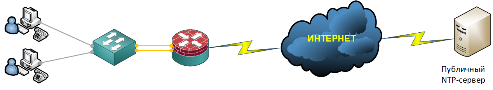

### NTP (Network Time Protocol)

Настроить NTP протокол на маршрутизаторах Cisco можно в двух режимах: сервер (устройство раздает время) или клиент (устройство синхронизируется с внешним сервером).

Чуть ниже я немного расскажу о концепции организации NTP-сервера и на примере конфигурационных команд проиллюстрирую как сконфигурировать NTP протокол на оборудовании Cisco с возможностью работы в обоих режимах.
<br><br>

<br><br>
Концепция организации NTP-сервера в большом или малом офисе в целом очень проста: на сетевом устройстве к которому подключена сеть Интернет с помощью конфигурационных команд настраивают NTP протокол. При этом в качестве авторитетного источника времени, с которого получают исходное время могут выступать например, атомные часы ("внешний сервер"), которые могут быть доступны в сети Интернет. Сетевое устройство подключается к внешнему источнику точного времени, синхронизирует свои часы и затем уже выступает в качестве NTP-сервера (позволяя другим устройствам подключаться к себе для синхронизации времени).

Конфигурирование NTP протокола на сетевом оборудовании Cisco производиться следующим образом:

1. Для начала мы установим свою временную зону (для Московского часового пояса - MSK); так же настроим периодическую синхронизацию календаря и времени clock, которое генерирует кварцевый резонатор, пока устройство Cisco включено:
```
clock timezone MSK 3 0
clock calendar-valid
```

2. Затем нам необходимо определиться со списком NTP-серверов в сети Интернет, с которых мы будем забирать время. Тем самым мы ограничим круг внешних серверов для синхронизации времени и немного повысим безопасность:
```
ip access-list extended NTP-NtpServerSourcePeers-ACL
 remark ===[ Allow access to external NTP server - ntp.msk-ix.ru ]===
 permit udp host 194.190.168.1 any
 remark ===[ Allow access to external NTP server - ntp0.ntp-servers.net ]===
 permit udp host 88.147.254.227 any
 remark ===[ Allow access to external NTP server - ntp3.ntp-servers.net ]===
 permit udp host 88.147.254.229 any
 remark ===[ Allow access to external NTP server - ntp6.ntp-servers.net ]===
 permit udp host 88.147.254.235 any
 remark ===[ We prohibit everything that is not parted, above ]===
 deny   ip any any
```

3. На следующем шаге мы определим список IP-адресов устройств или подсетей, которым мы разрешим синхронизировать свое время с нашим NTP-сервером. Делаем это мы с помощью списков доступа, тем самым еще на немного повышаем свою безопасность:
```
ip access-list extended NTP-NtpClientsDestinationPeers-ACL
 remark ===[ Allow access to the internal NTP server from the subnet: 10.77.5.0 - 10.77.5.255 ]===
 permit udp 10.77.5.0 0.0.0.255 host 10.77.5.1 eq ntp
 remark ===[ Allow access to the internal NTP server from the subnet: 10.77.6.0 - 10.77.6.255 ]===
 permit udp 10.77.6.0 0.0.0.255 host 10.77.5.1 eq ntp
 remark ===[ Allow access to the internal NTP server from the subnet: 10.77.7.0 - 10.77.7.255 ]===
 permit udp 10.77.7.0 0.0.0.255 host 10.77.5.1 eq ntp
 remark ===[ We prohibit everything that is not parted, above ]===
 deny   ip any any
```

4. Практически на финальном этапе по конфигурированию NTP протокола на оборудовании Cisco мы должны сделать следующее: включить логирование событий с нашего NTP-сервера; задать интерфейс с которого мы будем раздавать время; задать список откуда мы будем забирать время и кому будем его раздавать; включить NTP-сервер и указать основной NTP-сервер в глобальной сети Интернет, с которым мы будем синхронизироваться:
```
ntp logging
ntp source Port-channel1.998
ntp access-group peer NTP-NtpServerSourcePeers-ACL kod
ntp access-group serve NTP-NtpClientsDestinationPeers-ACL kod
ntp master 3
ntp server 194.190.168.1 prefer source GigabitEthernet0/0/1
ntp server 88.147.254.235 source GigabitEthernet0/0/1
ntp server 88.147.254.227 source GigabitEthernet0/0/1
ntp server 88.147.254.229 source GigabitEthernet0/0/1
```

5. Финальным аккордом мы на интерфейсе который смотрит в интернет включаем работу NTP протокола:
```
interface GigabitEthernet0/0/1
 description ===[ ISP: Dom.ru, Telephone: 8-495-981-45-71, Contract: 100771XXXXXX032 ]===
 no ntp disable
```


Для коммутатора
```
ntp logging
ntp update-calendar
ntp server 10.77.5.1 prefer source Vlan998
```
