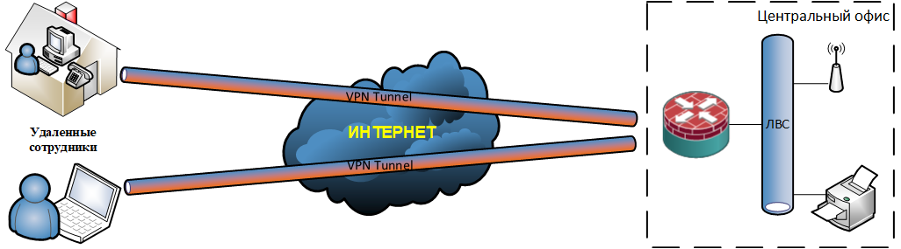

### Remote Access VPN

Remote Access VPN — это технология, которая обеспечивает безопасное подключение удаленного пользователя к централизованной корпоративной сети через публичный интернет. Этот тип VPN еще называют VPN удаленного доступа.
  

  
Работает это следующим образом: на устройстве сотрудника — ноутбуке, смартфоне и т.д. — устанавливается специальное программное обеспечение VPN-клиент. Когда пользователь запускает его и проходит аутентификацию, между его устройством и VPN-шлюзом компании создается зашифрованный туннель. Целевой корпоративный трафик с этого устройства направляется через этот туннель, и для внутренних ресурсов сети — файловых серверов, баз данных — сотрудник выглядит так, будто он физически находится в офисе. 

### Удаленный доступ Remote Access к IOS серверу с помощью AnyConnect клиента

При работе с AnyConnect клиентом используется собственная реализация Cisco EAP метода AnyСonnect-EAP. Все коммуникации EAP терминируются на самом сервере FlexVPN. Это отличается от стандартного EAP (например EAP-MD5 или EAP-GTC), когда FlexVPN сервер пробрасывает запросы EAP на внешний AAA сервер (RADIUS).

При этом возможна как локальная аутентификация/авторизация пользователей, так и с использованием внешнего AAA сервера (LDAP). Локальная аутентификация/авторизация довольно удобна для небольших сетей, так не требуется отдельный выделенный AAA сервер.

FlexVPN сервер обязательно должен иметь сертификат, который он предоставляет удаленному пользователю при подключении для проверки подлинности этого сервера. Пользователь же может быть аутентифицирован сервером по имени и паролю, либо своему сертификату.

По умолчанию, AnyConnect использует протокол SSL вместо IPSec, так что потребуется создать отдельный профиль для работы по IPSec. Это можно сделать с помощью редактора профилей AnyConnect «VPN Profile Editor».

Технология на сетевом оборудовании Cisco конфигурируется следующим образом:

