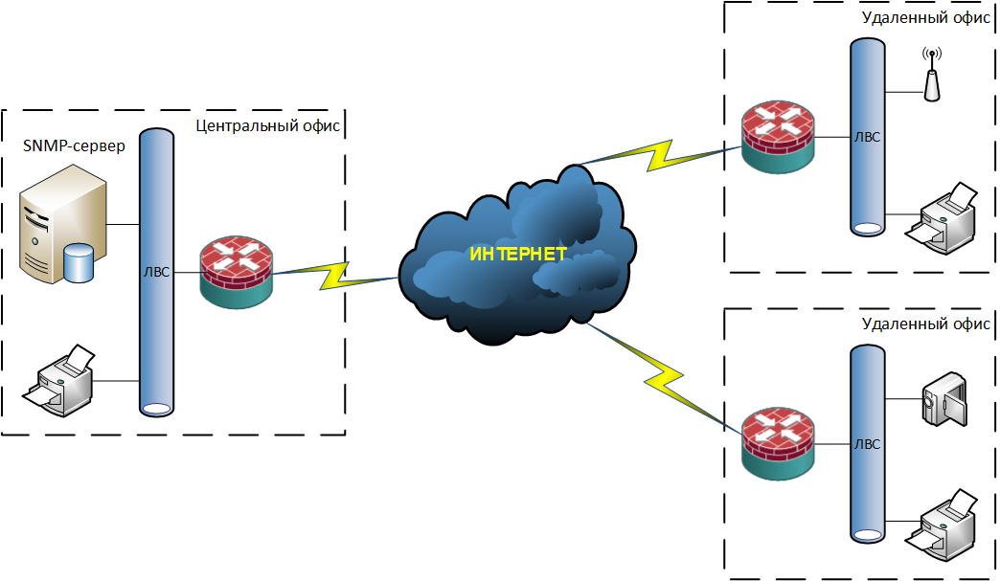
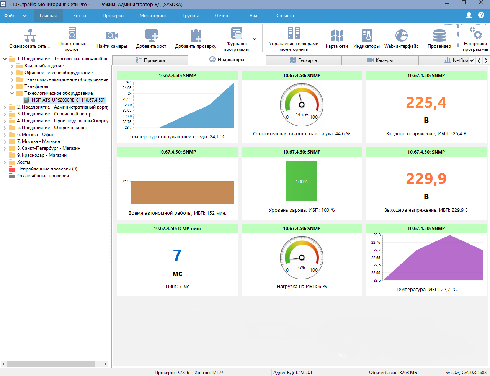

### SNMP (Simple Network Management Protocol)

Как известно протокол SNMP решает две задачи: мониторинг и управления сетевым оборудованием. Вторая задача не менее важна чем первая, но нас в большей степени интересует SNMP-мониторинг. Который позволяет ответить на вопрос: Что происходит с оборудованием в реальном времени?

Немного о концепции SNMP-мониторинга на предприятии чуть ниже.
<br><br>

<br><br>
В центральном офисе компании выделен сервер под SNMP-мониторинг, на котором установлено соответствующее программное обеспечение. Посредством SNMP-агентов или ODI с оборудования, собираются SNMP-данные которые в режиме реального времени анализируются программным обеспечением с информированием заинтересованных лиц (по средствам различных графиков, сообщений об аварии или иной инфографики).
<br><br>

<br><br>
Конфигурирование SNMP-протокола на сетевом оборудовании Cisco производиться следующим образом:

```
snmp-server community CiscoPublic RO SNMP-SnmpAccessHost-ACL
snmp-server community CiscoPrivate RW SNMP-SnmpAccessHost-ACL
snmp-server location Moscow
snmp-server contact SysEng <1027@xxx-yyy.ru>
snmp-server host 10.67.1.34 version 2c CiscoPrivate
snmp-server host 10.67.1.34 version 2c CiscoPublic
snmp mib flash cache
```

Ввиду того что мы используем в своей работе самую распространенную на сегодняшний день версию SNMPv2c-протокола, у которой security-модель по сравнению с SNMPv1 осталось той же: community string, без шифрования стоит ограничит сбор SNMP-данных c определенных IP-адресов. Это делается по средствам access-листов:


</code></pre>
</details>
<details>
<summary>Для коммутатора</summary>
<pre><code>
```
ip access-list standard SNMP-SnmpAccessHost-ACL
 remark ===[ Allowing access to the SNMP protocol from an IP address: 10.67.1.34 (APP-XXXXXX04) ]===
 permit 10.67.1.34
 remark ===[ We prohibit everything that is not parted, above ]===
 deny   any
```
</code></pre>
</details>

</code></pre>
</details>
<details>
<summary>Для маршрутизатора</summary>
<pre><code>
```
ip access-list extended SNMP-SnmpAccessHost-ACL
 remark ===[ Allowing access to the SNMP protocol from an IP address: 10.67.1.34 (APP-XXXXXX04) ]===
 permit udp host 10.67.1.34 any eq snmp
 remark ===[ Allowing access to the SNMP protocol from an IP address: 10.67.1.34 (APP-XXXXXX04) ]===
 permit udp host 10.67.1.34 any eq snmptrap
 remark ===[ We prohibit access to the SNMP protocol from all other IP addresses ]===
 deny   udp any any eq snmp
 remark ===[ We prohibit access to the SNMP protocol from all other IP addresses ]===
 deny   udp any any eq snmptrap
 remark ===[ We prohibit everything that is not parted, above ]===
 deny   ip any any
```
</code></pre>
</details>
