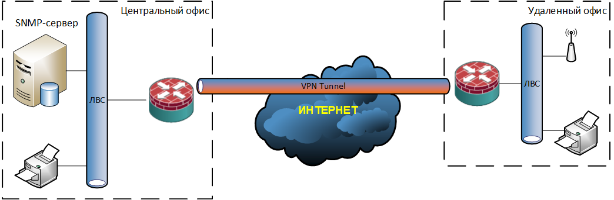

### Site-to-Site VPN (Virtual Private Network)

Site-to-Site VPN создает туннель, который поднимается между двумя локальными сетями. Его главная задача — объединить разрозненные филиалы, удаленные офисы или облачные инфраструктуры в единое приватное сетевое пространство.
<br><br><center>

</center><br>
Схема подключения выглядит так: в каждой из соединяемых сетей, например, в головном офисе и филиале, на границе устанавливается VPN-шлюз — это может быть специализированное устройство, сервер или маршрутизатор с соответствующим ПО.

Эти шлюзы настраиваются друг на друга, и между ними автоматически устанавливается защищенное соединение. После настройки пользователи в обоих офисах получают прозрачный доступ к общим ресурсам: сотрудник в филиале может обращаться к серверу в головном офисе, как к локальному, и наоборот. На самих рабочих станциях пользователей при этом ничего настраивать не нужно.

### FlexVPN Spoke-to-Spoke топология

Топология FlexVPN Hub-to-Spoke очень удобна, когда имеется головной центральный офис (Hub) и несколько удаленных филиалов (Spoke). В этом случае достаточно настроить Hub и один Spoke, а добавление последующих Spoke маршрутизаторов будет достаточно простым. Это решение позволяет строить легко масштабируемые сети и быстро подключать новые филиалы. В топологии FlexVPN Hub-to-Spoke применяются IKEv2 и IPSec. Это решение является дальнейшим развитием DMVPN и неофициально считается DMVPN 4-й фазы.

Топология FlexVPN Spoke-to-Spoke позволяет Spoke маршрутизаторам общаться между собой напрямую, а не только через центральный Hub. Что, во-первых, снижает требования к пропускной способности канала связи на Hub-е и его загрузку. Во-вторых, уменьшает задержки при передаче трафика между Spoke маршрутизаторами. Для решения этой задачи, так же, как и в DMVPN, задействуется протокол «Next Hop Resolution Protocol» (NHRP). Основное назначение NHRP – это выстроить таблицу соответствия публичных IP адресов Spoke маршрутизаторов и IP адресов их туннелей.

Отличия от классического DMVPN состоят лишь в следующем:
- В DMVPN протокол NHRP применяется для регистрации и разрешения публичных IP адресов (registration and resolution NBMA);
- Во FlexVPN протокол NHRP используется только для разрешения публичных IP адресов (resolution NBMA);
- Во FlexVPN нет Multipoint GRE (mGRE), а только стандартный GRE протокол;
- Нет необходимости в протоколах динамической маршрутизации (RIP, EIGRP, OSPF, и т.п.), если использовать встроенные возможности маршрутизации IKEv2.

Конфигурирование топологии FlexVPN Spoke-to-Spoke на оборудовании Cisco происходит следующим образом:

1. Создаем IKEv2 Proposal и затем ее привязываем к IKEv2 Policy:
```
crypto ikev2 proposal FLEXVPN-GeneralProposal-IKEV2
 encryption aes-cbc-256
 integrity sha256
 group 19

crypto ikev2 policy FLEXVPN-GeneralPolicy-IKEV2
 proposal FLEXVPN-GeneralProposal-IKEV2
```

2. Создаем IKEv2 Keyring это репозиторий с набором предварительно заданных ключей (они используются для аутентификации указанных там устройств):
```
crypto ikev2 keyring FLEXVPN-GeneralKeyring-IKEV2
 peer SPOKE
  description ===[ Authentication settings for slave equipment ]===
  address 0.0.0.0 0.0.0.0
  pre-shared-key local !Password!
  pre-shared-key remote !Password!
```

3. Прежде чем перейти к сборке Profile нам необходимо определиться со списком подсетей к которым мы разрешим доступ из филиалов (мы не будем использовать динамическую маршрутизацию, а воспользуемся возможностями самого протокола IKEv2 для обмена маршрутной информацией):
```
ip access-list standard FLEXVPN-RoutedSubnets-ACL
 remark ===[ Allow routing in subnets: 10.67.1.0, 10.67.2.0, 10.67.2.144, 10.67.4.0, 10.67.4.128 ]===
 permit 10.67.1.0 0.0.0.127
 permit 10.67.2.0 0.0.0.127
 permit 10.67.2.144 0.0.0.15
 permit 10.67.4.0 0.0.0.127
 permit 10.67.4.128 0.0.0.127
 remark ===[ We prohibit everything that is not parted, above ]===
 deny   any

aaa new-model
aaa authorization network FLEXVPN-AuthorizationLocal-AAA local

crypto ikev2 authorization policy FLEXVPN-AuthorizationPolicy-IKEV2
 route set interface
 route set access-list FLEXVPN-RoutedSubnets-ACL
```

4. Собираем IKEv2 Profile это репозиторий фиксированных параметров IKE SA (таких как local или remote identities, доступных методов аутентификации и так далее). Причем на данном шаге IKEv2 Profile мы собрали на 99%:
```
crypto ikev2 profile FLEXVPN-GerenalProfile-IKEV2
 description ==[ Profile of available authentication methods ]===
 match identity remote fqdn domain xxx-yyy.ru
 identity local fqdn RT-EDGE-GRN01.xxx-yyy.ru
 authentication remote pre-share
 authentication local pre-share
 keyring local FLEXVPN-GeneralKeyring-IKEV2
 aaa authorization group psk list FLEXVPN-AuthorizationLocal-AAA FLEXVPN-AuthorizationPolicy-IKEV2
```


```
crypto ikev2 profile FLEXVPN-GerenalProfile-IKEV2
  virtual-template 1
```

