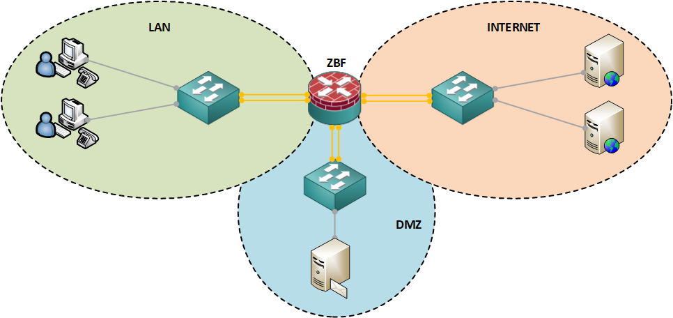

### ZBF (Zone-Based Firewall)

Zone-Based Firewall (ZBF) — это модель межсетевого экрана, которая разделяет сеть на логические зоны и управляет трафиком между ними. В отличие от традиционных брандмауэров, работающих на основе списков контроля доступа (ACL), ZBF позволяет более гибко и контекстуально настраивать правила безопасности, учитывая, из какой зоны трафик приходит и в какую направляется.

<br><br><center>

</center><br><br>

Работа ZBF строится на трёх ключевых шагах:
  - <b>Создание зон</b>. Определяются логические сегменты сети. Например, могут быть созданы зоны для внутренней сети (LAN), демилитаризованной зоны (DMZ) и интернета (WAN).
  - <b>Назначение интерфейсов</b>. Сетевые интерфейсы (порты маршрутизатора) включаются в соответствующие зоны. Важно, что каждый интерфейс может принадлежать только одной зоне.
  - <b>Определение политик</b>. Создаются правила, которые регулируют, какой трафик может пересекать границы зон. Эти правила могут учитывать протоколы, порты, IP-адреса и характер трафика. Например, можно разрешить только HTTP и HTTPS-трафик между интернетом и DMZ.

ZBF поддерживает концепцию «проверка по умолчанию» (default deny), что означает, что весь трафик, который не соответствует установленным политиками, блокируется. Это создает дополнительный уровень защиты, предотвращая несанкционированный доступ.

Конфигурирование технологии ZBF на сетевом оборудовании Cisco производиться следующим образом:

Создать зоны безопасности. После начального планирования определить требуемые зоны
безопасности и присвоить им имена, используя команду:

1. Создаем зоны безопасности:
```
zone security LAN
 description ===[ LAN - security zone ]===
zone security WAN
 description ===[ WAN - security zone ]===
```

2. С помощью class-map, описываем трафик, к которому будет применяться требуемая политика безопасности при его прохождении между парой зон. На этом этапе используется специальный тип class-map, называемый <b>class-map type inspect</b> и он определяет, что именно будет инспектироваться:
```
class-map type inspect match-any ZBF-AllowedProtocolsOut-CMAP
  description ===[ We describe the traffic that is allowed to pass through interfaces on the Internet ]===
 match protocol dns
 match protocol ftp
 match protocol ftps
 match protocol http
 match protocol https
 match protocol icmp
 match protocol tcp
 match protocol udp
 match protocol imap
 match protocol imap3
 match protocol imaps
 match protocol ntp
 match protocol pop3
 match protocol pop3s
 match protocol smtp
 match protocol ssh
 match protocol sip
class-map type inspect match-all ZBF-FLEXVPNAllowedProtocolsIn-CMAP
  description ===[ We describe the traffic that is allowed to pass through interfaces from the Internet ]===
 match access-group name FLEXVPN-AllowedProtocol-ACL
class-map type inspect match-all ZBF-FLEXVPNAllowedProtocolsOut-CMAP
  description ===[ We describe the traffic that is allowed to pass through interfaces on the Internet ]===
 match access-group name FLEXVPN-AllowedProtocol-ACL
class-map type inspect match-any ZBF-AllowedProtocolsIn-CMAP
  description ===[ We describe the traffic that is allowed to pass through interfaces from the Internet ]===
 match protocol icmp
```

3. Затем с помощью policy-map, описываем требуемые действия с трафиком, описанным ранее с помощью class-map. Для этих целей используется специальный тип policy-map, называемый <b>policy-map type inspect</b>:
```
policy-map type inspect ZBF-LAN-TO-WAN-PMAP
 description ===[ We describe the rules for inspecting, passing and prohibiting traffic from LAN to WAN ]====
 class type inspect ZBF-AllowedProtocolsOut-CMAP
  inspect
 class type inspect ZBF-FLEXVPNAllowedProtocolsOut-CMAP
  pass
 class class-default
  drop
policy-map type inspect ZBF-WAN-TO-LAN-PMAP
 description ===[ We describe the rules for inspecting, passing and prohibiting traffic from WAN to LAN ]===
 class type inspect ZBF-AllowedProtocolsIn-CMAP
  inspect
 class type inspect ZBF-FLEXVPNAllowedProtocolsIn-CMAP
  pass
 class class-default
  drop
```

4. Создаем пары зон безопасности zone-pair. Пары создаются только для зон источника/получателя трафика, где будут применяться политики безопасности. Включить обработку правил прохождения трафика, между зонами позволяет команда <b>service-policy type inspect</b>:
```
zone-pair security LAN-TO-WAN source LAN destination WAN
 description ===[ The passage of network traffic from the LAN - security zone to the WAN - security zone ]=== 
 service-policy type inspect ZBF-LAN-TO-WAN-PMAP
zone-pair security WAN-TO-LAN source WAN destination LAN
 description ===[ The passage of network traffic from the WAN - security zone to the LAN - security zone ]=== 
 service-policy type inspect ZBF-WAN-TO-LAN-PMAP
```

5. Для активации правил ZBF необходимо интерфейсам присвоить соответствующие зоны которые были созданы на 1-м шаге (например):
```
interface Tunnel0
 zone-member security LAN

interface GigabitEthernet0/0/1
 description ===[ ISP: MTS.ru, Telephone: 8-800-250-09-90, Contract: XXXXXXXXXXXX ]===
 zone-member security WAN
```

Полный текст конфигурационных файлов приведены [здесь](../config/)
